# Dayflow Architecture

How the system is put together, why it is put together that way, and what
happens when someone clicks something.

---

## 1. The shape of it

Dayflow is a **client / server split** where the server is **nine
microservices** behind a single **API gateway**.

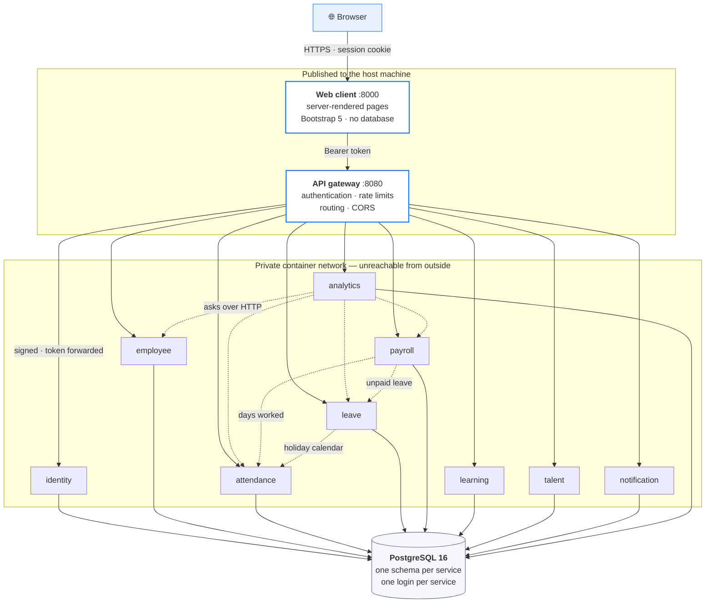

Solid arrows are the request path. Dotted arrows are one service asking another
for something it does not own.

### Why microservices, honestly

The usual argument is scaling, and that does apply — payroll is busy for two
days a month while attendance is busy twice a day, every day. But the reasons
that matter most here are different:

**Each part can be understood on its own.** The payroll calculation is a few
hundred lines in one place, not a few hundred lines scattered through a much
larger program.

**Access control is enforced by the database, not by discipline.** Each service
logs into PostgreSQL with its own role, granted rights on its own schema only.
The payroll service *cannot* read attendance rows. That is a far stronger
statement than "no payroll code currently reads attendance rows", and it stays
true no matter what anyone writes later.

**A fault stays where it happened.** If the learning service stops, people can
still clock in and apply for leave; one card on the dashboard goes quiet.

The cost is real: a network hop where a function call would do, and data that
has to be assembled from several places. The dashboard endpoint is the clearest
example — it makes several calls to build one screen. That trade is made
deliberately and is documented at the call sites.

---

## 2. The layers

```mermaid
graph LR
    subgraph L1["1 · Presentation"]
        direction TB
        V["Views<br/><i>templates, all output escaped</i>"]
        C["Controllers<br/><i>read input, call the API, render</i>"]
    end

    subgraph L2["2 · Edge"]
        direction TB
        G["Gateway<br/><i>verify · throttle · route · sign</i>"]
    end

    subgraph L3["3 · Application"]
        direction TB
        SC["Service controllers<br/><i>validate, authorise, respond</i>"]
        SS["Domain services<br/><i>the business rules</i>"]
    end

    subgraph L4["4 · Data"]
        direction TB
        R["Repositories<br/><i>mass-assignment guard</i>"]
        Q["QueryBuilder<br/><i>everything bound</i>"]
    end

    subgraph L5["5 · Storage"]
        direction TB
        PG[("PostgreSQL<br/><i>constraints · roles · grants</i>")]
    end

    L1 --> L2 --> L3 --> L4 --> L5

    style L1 fill:#e8f1ff,stroke:#1c77fd
    style L2 fill:#fff4e5,stroke:#d97706
    style L3 fill:#e7f7ed,stroke:#16a34a
    style L4 fill:#f3e8ff,stroke:#8b5cf6
    style L5 fill:#f5f7fb,stroke:#5a6a85
```

A rule worth stating plainly: **each layer re-checks what matters rather than
trusting the one above it.**

The web client hides a menu item you may not use. The gateway rejects a call
without a valid token. The service checks the permission again, and then checks
whether *this particular record* is yours. The repository refuses to write a
column that was not declared writable. The database refuses a status value
outside its `CHECK` constraint.

Any one of those could be bypassed by a mistake. All five failing at once is
what it would take for something to go wrong.

---

## 3. The classes that matter

### The shared kernel

Every service is built on the same foundation, so that a security decision is
made once rather than nine times.

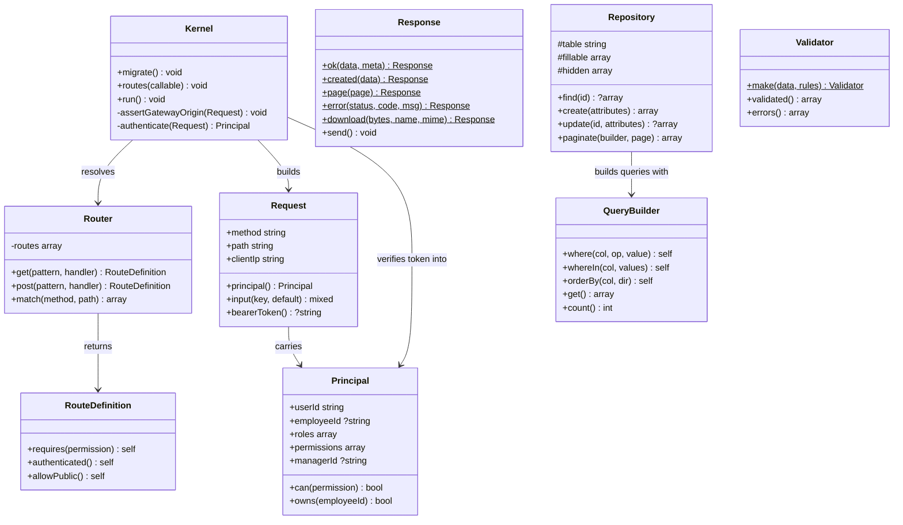

`Kernel` is the important one. It is why every service front controller is four
lines: the kernel runs the migrations, verifies the gateway signature, verifies
the token, enforces the route's permission and shapes every error. A service
author cannot forget those steps, because they are not their job.

### Security

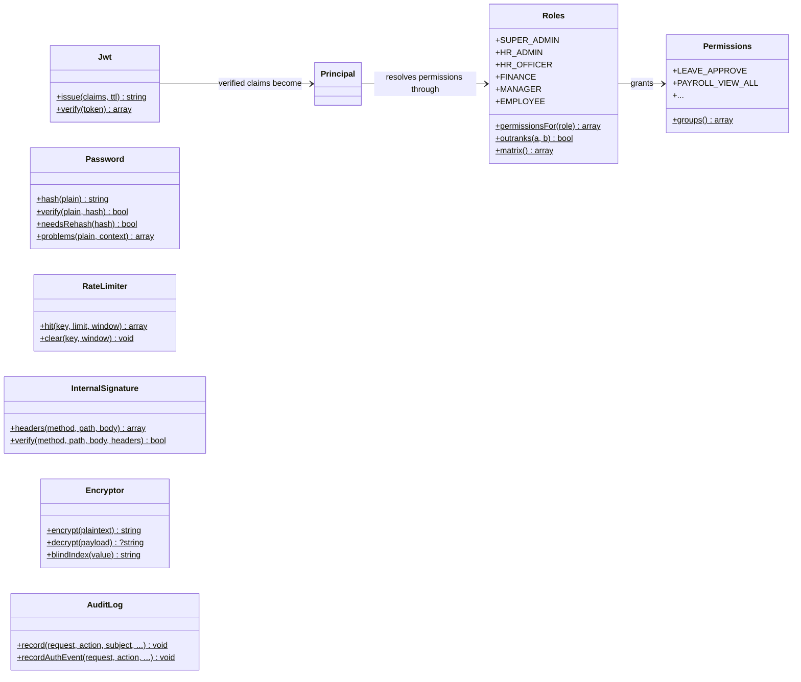

Two design decisions worth calling out.

**Role inheritance is declared, not derived.** It would be tempting to order the
roles by seniority and let each one inherit everything beneath it. That would
quietly hand the Finance Officer every permission of a People Manager, because
Finance happens to sit above Manager in the list. Inheritance is therefore an
explicit map, and Finance inherits from Employee only.

**Permissions are recomputed, never trusted from the token.** `Principal` reads
the *roles* from the verified token but looks the *permissions* up in the role
catalogue. A token issued before a permission was withdrawn from a role cannot
still carry it.

### The web client

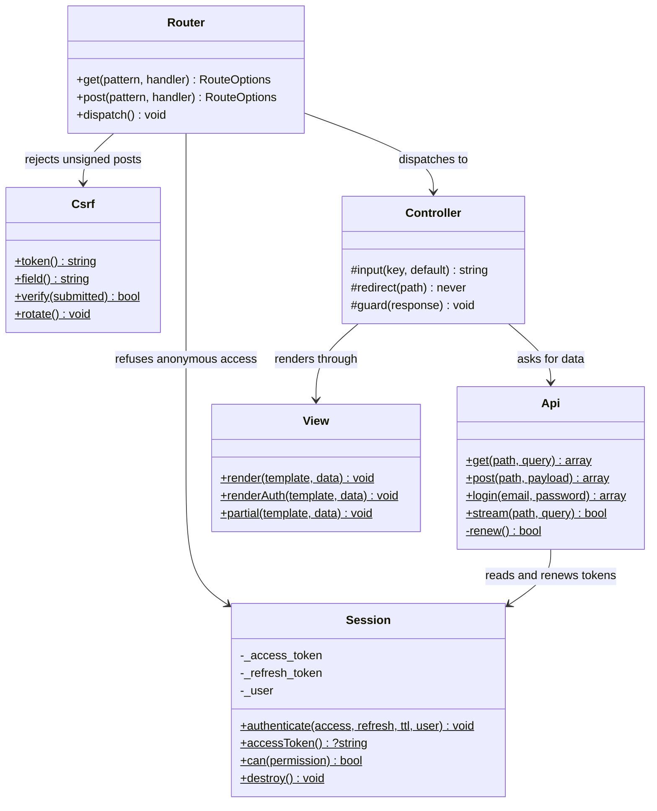

The single most important property here: **`Session` holds the tokens, so the
browser never does.** The browser gets an opaque `HttpOnly` cookie. A
cross-site scripting flaw in a template could not steal a credential the
document never contained.

---

## 4. What happens when someone applies for leave

The clearest end-to-end illustration, because it touches authentication,
authorisation, validation, a cross-service call, a transaction and an event.

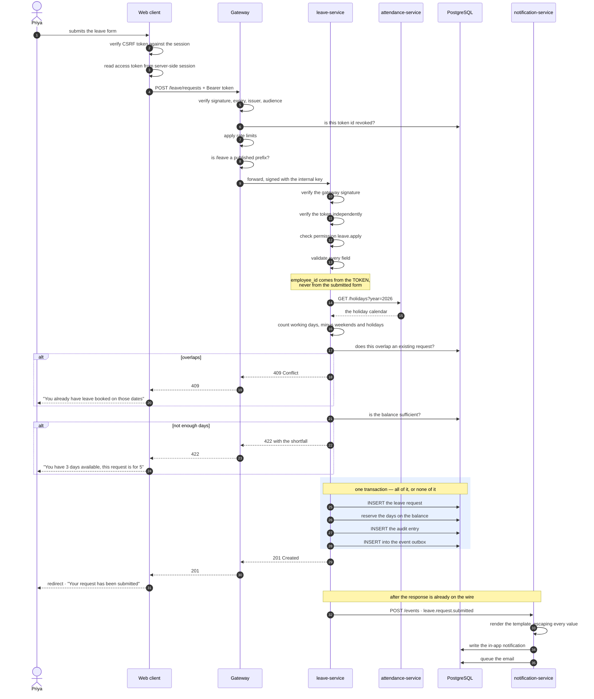

**Steps 12 to 15 are the point.** Four writes, one transaction. A leave request
cannot exist without its reserved days, its audit entry, and its queued
notification. If any one of them fails, none of them happened.

**Step 24 onwards happens after the browser already has its answer.** The person
is not kept waiting while an email is composed, and a notification service that
is briefly down delays a message rather than blocking an approval.

---

## 5. Signing in

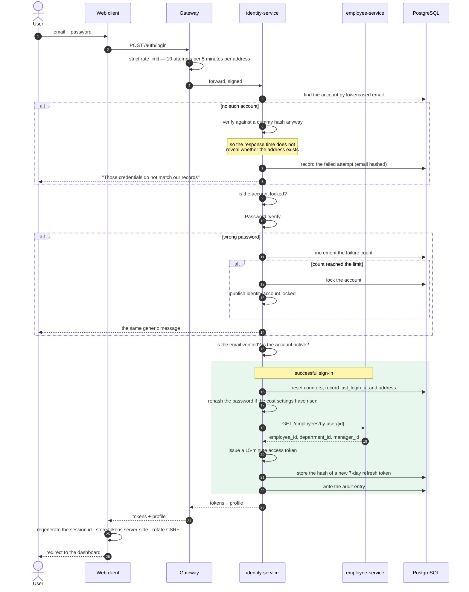

The failure branches all end in the same sentence on purpose. A sign-in form
that distinguishes "no such account" from "wrong password" is a directory of
who works at the company, available to anyone.

---

## 6. Refresh token rotation, and how theft is caught

Access tokens last fifteen minutes. Refresh tokens last a week, and **rotate on
every use**: presenting one returns a new one and marks the old one spent.

That rotation is what makes theft detectable.

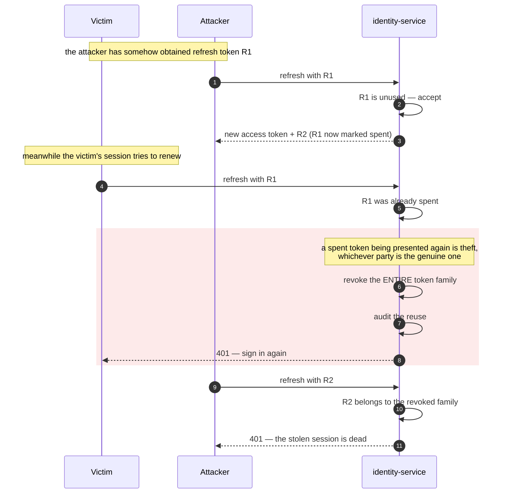

The victim is signed out once and signs back in. The attacker's stolen session
is destroyed. Without rotation, a stolen refresh token would work quietly for a
week.

---

## 7. How a payroll run assembles itself

The most cross-service operation in the product.

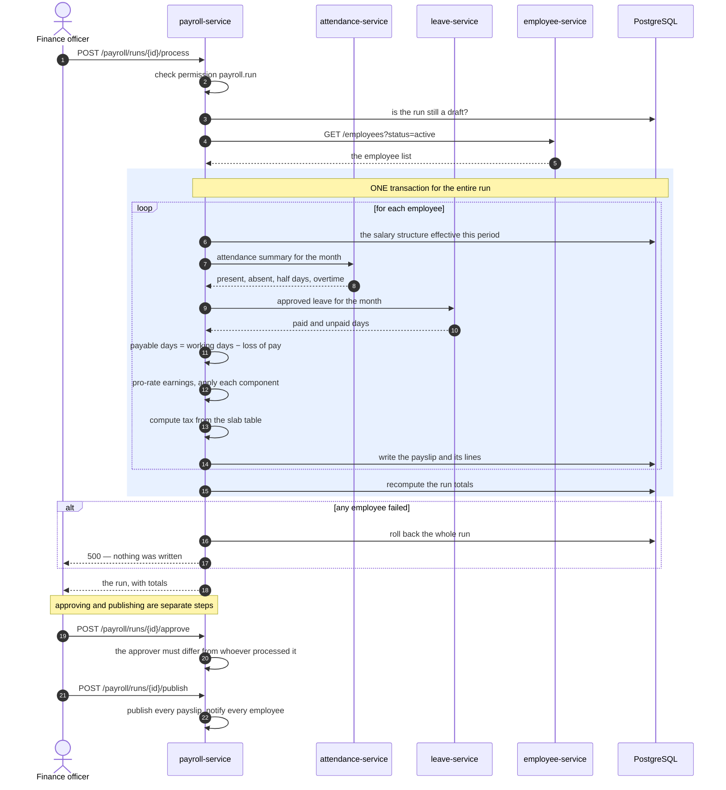

**An all-or-nothing run is the point.** A payroll run that half-succeeded would
leave some people paid and others not, with no clear record of which. Rolling
back the entire run and reporting the failure is the only defensible behaviour.

**Processing, approving and publishing are three separate actions**, and the
approver must be someone other than the person who processed it. That is
ordinary separation of duties, and it is the control that makes payroll
auditable.

---

## 8. Data ownership

Each service owns its schema outright. Nothing reaches across.

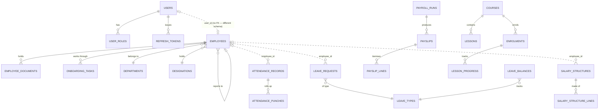

Solid lines are real foreign keys, inside one schema. **Dotted lines are plain
UUID columns with no foreign key** — the referenced table is in another schema
that this database role cannot see. That is not an oversight; it is what service
independence costs, and what it buys.

The consequence: when the attendance service needs someone's name, it asks the
employee service. There is exactly one place a name is stored, so there is
exactly one place to correct it.

---

## 9. Events, and why they use an outbox

A naive implementation posts a notification straight after the approval. If the
notification call fails, the approval is already committed and nobody is told.
If the approval is rolled back after the notification is sent, someone is told
about something that did not happen.

The **transactional outbox** removes both failures:

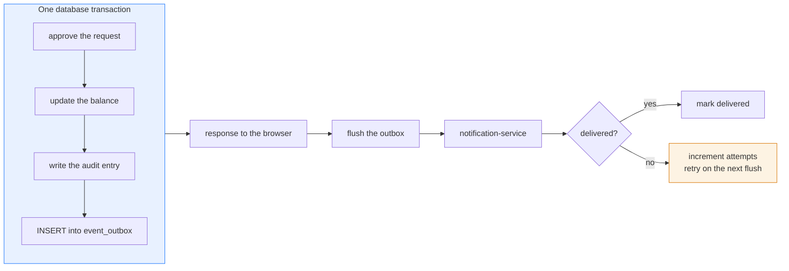

The event is written **in the same transaction as the change that produced it**.
It therefore cannot exist for a change that was rolled back, and it cannot be
missing for a change that was committed. Delivery happens afterwards and retries
until it succeeds.

The receiving side records every event id it has processed, so a retry that
arrives twice produces one notification.

---

## 10. Where the boundaries were drawn, and why

| Service | Why it is separate |
| --- | --- |
| **identity** | Credentials and tokens are the most sensitive thing here. Keeping them in one small service means the code that touches a password hash is a few hundred lines that can be read closely. |
| **employee** | The single system of record for a person. If a name lived in two places, they would disagree within a month. |
| **attendance** | The highest write volume in the system — several punches per person per day — and the only part with a real-time element. |
| **leave** | Balances and accrual are genuinely intricate rules that change with company policy, and they change independently of everything else. |
| **payroll** | The most sensitive data and the strictest correctness requirement. Separating it means the set of things that can read a salary is small and explicit. |
| **learning** | Almost entirely independent of the rest. It exists because it is a real HR need, and it costs nothing to isolate. |
| **talent** | Review visibility rules (who may see an unsubmitted review, an anonymous reviewer) are subtle enough to deserve their own place. |
| **notification** | The only service that talks to the outside world by email. One outbound path is one thing to secure. |
| **analytics** | Read-only and aggregating. It has no data of its own, which is exactly why it is safe for it to see across everything — it sees only what the asking user is entitled to. |

### Things deliberately *not* split

- **Attendance and timesheets** stay together: they share the same records and
  would need a chatty conversation if separated.
- **Payroll and expenses** stay together: both are money owed to an employee and
  both end in a payment run.
- **Goals and reviews** stay together: a review is largely an assessment of
  goals, and separating them would mean fetching one to render the other.

---

## 11. Deployment topology

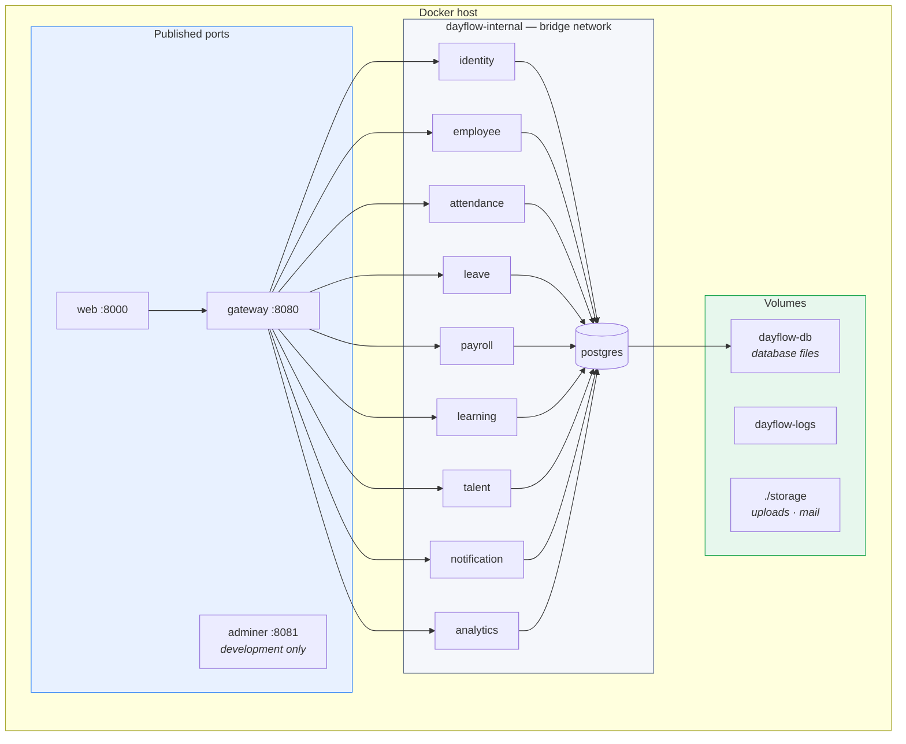

All eleven PHP containers run the **same image**, differing only in which source
directory is mounted and which environment variables they receive. One image to
build, one to patch, and no possibility of one service running an older runtime
than another.

Source is mounted **read-only**. The containers can write to exactly two places:
`/var/www/storage` and `/var/log/dayflow`.

### Scaling from here

`docker compose up --scale attendance-service=3` works as-is, because services
hold no state between requests. Everything that persists is in PostgreSQL.

Beyond one host: the compose file translates to Kubernetes manifests almost
directly. The pieces that would need attention first are a shared object store
for uploads instead of a bind mount, and a read replica for analytics.

---

## 12. What we would change with more time

Being honest about the seams:

- **The dashboard makes many calls.** It is the one endpoint where the
  microservice split is visibly expensive. A materialised summary table, updated
  by the events that already exist, would fix it.
- **Events are delivered by polling an outbox after each response.** That is
  reliable and easy to reason about, but a message broker would be a better fit
  once the volume grows.
- **`analytics` has no cache beyond sixty seconds.** For monthly reports that
  never change once a period closes, a longer-lived snapshot table is the
  obvious next step.
- **No multi-factor authentication.** The token model is ready for it; the
  second factor is not implemented.
